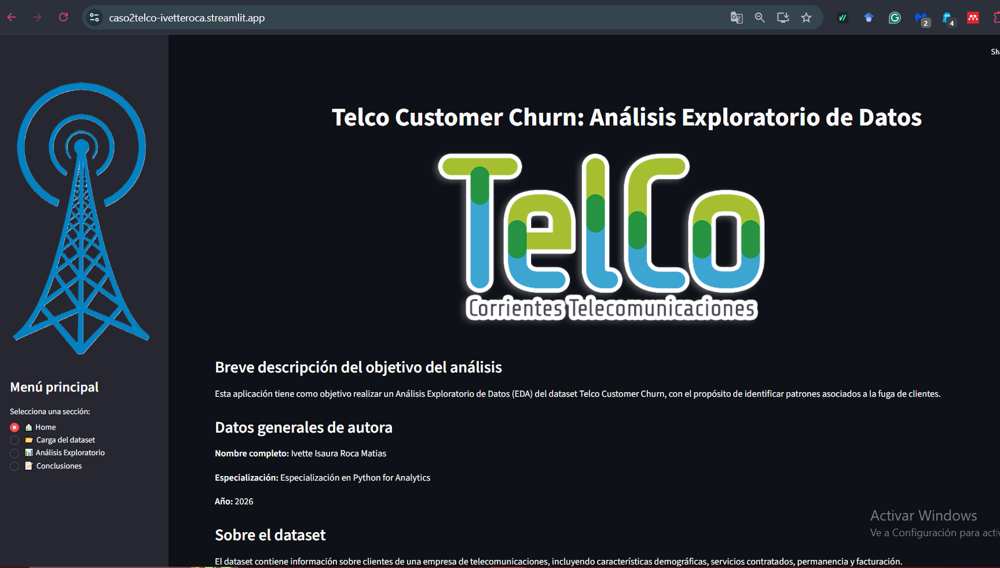
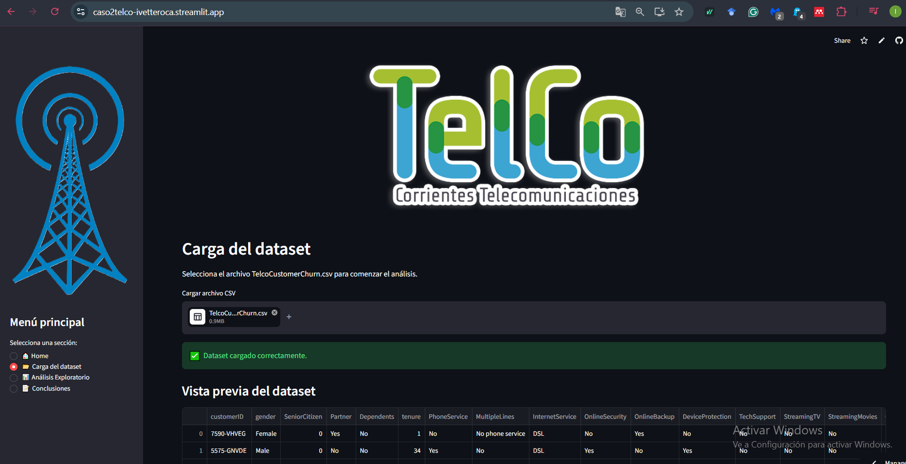
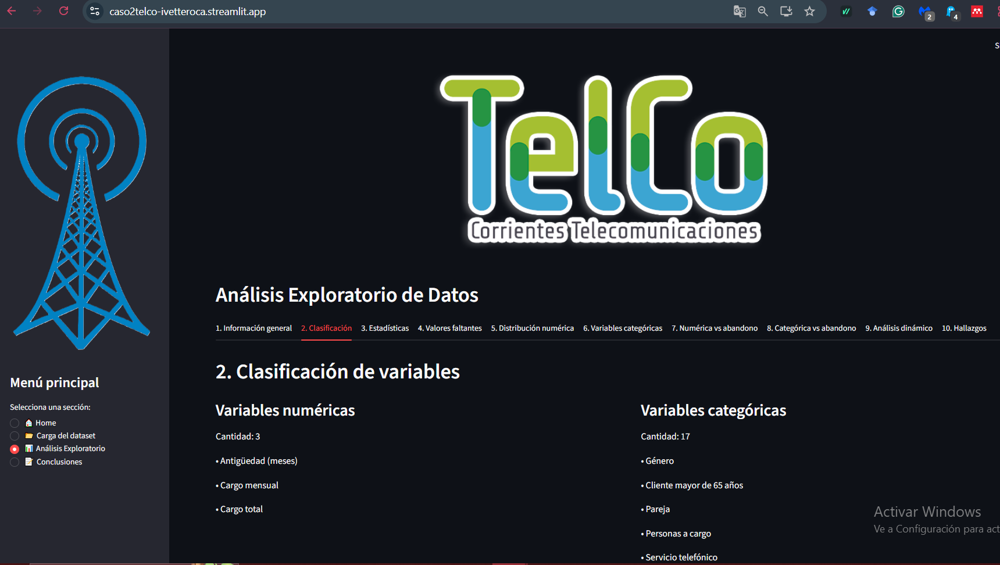
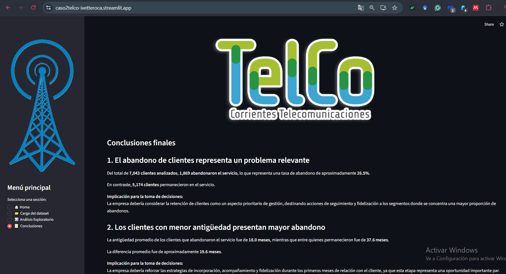

# Caso2_TelcoCustomerChurn_EDA

## Descripción del proyecto

Este proyecto desarrolla una aplicación interactiva para realizar un Análisis Exploratorio de Datos (EDA) sobre información histórica de clientes de una empresa de telecomunicaciones.

El dataset TelcoCustomerChurn.csv contiene información relacionada con las características de los clientes, los servicios contratados, la facturación mensual, el tiempo de permanencia y su estado actual en la empresa.

El análisis surge en un contexto en el que, durante el último mes, la empresa experimentó un incremento en su ratio de fuga de clientes de 0,5 puntos porcentuales, pasando de un promedio de 2 % a 2,5 %.

Esta situación resulta especialmente relevante debido a que el costo de adquirir un nuevo cliente es considerablemente superior al costo de retener a un cliente existente. Por este motivo, resulta necesario analizar los datos históricos para identificar patrones asociados al abandono y detectar segmentos de clientes que podrían presentar un mayor riesgo de fuga.

El objetivo del proyecto es utilizar un enfoque exploratorio y visual para comprender las características asociadas al abandono de clientes y generar hallazgos que puedan servir como base para futuras estrategias de retención y fidelización.

## Capturas de la aplicación

### Página principal

### Carga del dataset

### Análisis exploratorio

### Conclusiones

## ¿Cómo ejecutar la aplicación?

Desde:

[streamlit run app.py](https://caso2telco-ivetteroca.streamlit.app/)

La aplicación se abrirá automáticamente en el navegador.

5. Cargar el dataset

Dentro de la aplicación:

Ingresar a 📂 Carga del dataset.
Seleccionar TelcoCustomerChurn.csv.
Acceder a 📊 Análisis Exploratorio.
Explorar las diferentes etapas del EDA.
Consultar 📝 Conclusiones para revisar los principales hallazgos.

## Links relevantes

Repositorio del proyecto:
https://github.com/ivetterocamatias/Caso2_TelcoCustomerChurn_EDA.git

Aplicación desplegada:
https://caso2telco-ivetteroca.streamlit.app/

